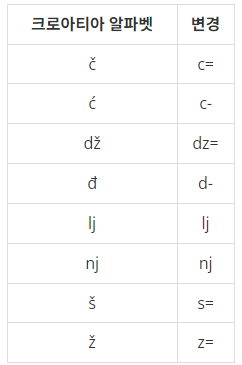

# [백준 2941] 크로아티아 알파벳

### 문제 링크
https://www.acmicpc.net/problem/2941

### 결과
메모리 : 31120 KB, 시간 : 40ms

### 분류
* 구현
* 문자열

### 문제 설명
예전에는 운영체제에서 크로아티아 알파벳을 입력할 수가 없었다. 따라서, 다음과 같이 크로아티아 알파벳을 변경해서 입력했다.



예를 들어, ljes=njak은 크로아티아 알파벳 6개(lj, e, š, nj, a, k)로 이루어져 있다. 단어가 주어졌을 때, 몇 개의 크로아티아 알파벳으로 이루어져 있는지 출력한다.

dž는 무조건 하나의 알파벳으로 쓰이고, d와 ž가 분리된 것으로 보지 않는다. lj와 nj도 마찬가지이다. 위 목록에 없는 알파벳은 한 글자씩 센다.

### 입력
첫째 줄에 최대 100글자의 단어가 주어진다. 알파벳 소문자와 '-', '='로만 이루어져 있다.

단어는 크로아티아 알파벳으로 이루어져 있다. 문제 설명의 표에 나와있는 알파벳은 변경된 형태로 입력된다.

### 출력
입력으로 주어진 단어가 몇 개의 크로아티아 알파벳으로 이루어져 있는지 출력한다.

## 초기 접근 방법
* 크로아티아 알파벳이 특이하기 때문에 표의 오른쪽에 있는 변경되는 알파벳들을 리스트에 저장

* 이 중에서 'dz='만 유일하게 문자열의 길이가 3이라서 따로 빼서 저장

``` python
lst = ['c=', 'c-', 'd-', 'lj', 'nj', 's=', 'z='] 
dz_case = ['dz=']
```

* 문자열을 돌면서 lst에 속하는 문자열이 존재하면 'alphabet_cnt' 변수에 1을 더하고, dz_case에 속하는 문자열이 존재하면 'dz_cnt' 변수에 1을 더하기
```python
alphabet_cnt = 0
    dz_cnt = 0
    for i in range(2, len(word)):
        if word[i-2 : i] in lst:
            alphabet_cnt += 1

    for j in range(3, len(word)):
        if word[i-3 : i] in dz_case:
            dz_cnt += 1
```
* 이렇게 저장된 값을 통해 최종 문자열의 길이를 계산하려고 다음과 같이 계산
```python
result = alphabet_cnt + dz_cnt + (len(word) - (alphabet_cnt * 2) - (dz_cnt * 3))
```

## 해결하지 못한 이유
* 다음과 같은 경우에는 'lst'에서 'z='와 'dz_case'에서 'dz='가 2번 계산되는 케이스가 발생
* 변수명 설정, 코드의 흐름, 시간 복잡도 등 고려하지 않은 부분이 많았다.

## 해결 코드 및 방법
```python
def croatia_alphabet_count(word):
    croatia_alphabet = ['c=', 'c-', 'd-', 'dz=', 'lj', 'nj', 's=', 'z=']

    for i in croatia_alphabet:
        word = word.replace(i, '*')
    
    result = len(word)
    return result
```
* 파이썬의 replace를 함수를 사용해서 입력 받은 단어 'word'에서 해당 크로아티아 알파벳이 존재하는 경우 '*'로 문자를 변경해서 문자열의 길이를 반환하도록 구성

## 추가 공부
## 1. replace() 함수?

- replace() 함수 → 문자열을 변경하는 함수
- 문자열 안에서 특정 문자를 새로운 문자로 변경하는 기능
- 사용 방법 : `변수.replace(old, new, [count])`
    - old : 현재 문자열에서 변경하고 싶은 문자
    - new : 새로 바꿀 문자
    - count : 변경할 횟수, 횟수는 입력하지 않으면 old의 문자열 전체를 변경, default → count = -1
- **replace 함수는 bytearray인 문자열만 변경할 수 있는 메서드**
    - 리스트, 튜플에서는 replace를 시도하면 AttributeError 에러가 발생

## 2. 함수 사용 예시

### 2-1. 문자를 변경하는 사용 예시

```python
# Example 1
a = "hello world"
a.replace("hello", "hi")

# 출력 -> hi world
```

```python
# Example 2
'oxoxoxoxox'.replace('ox', '*')

# 출력 -> *****
```

### 2-2. 문자열을 변경하면서 횟수를 지정하는 사용 예시

```python
'oxoxoxoxox'.replace('ox', '*', 1)

# 출력 -> *oxoxoxox
```

